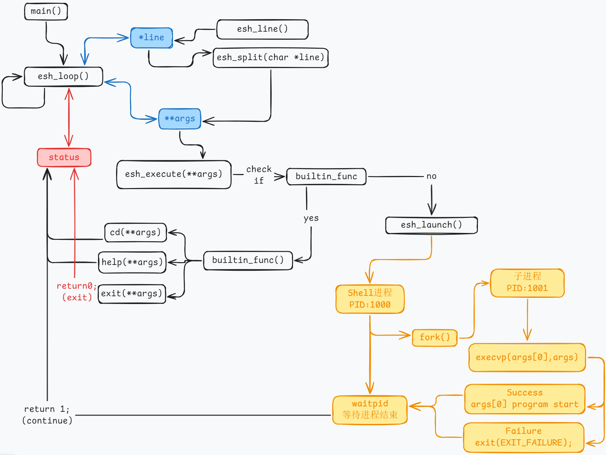

# 从零开始用C语言构建一个Unix Shell (esh)

本项目是一个循序渐进的教程，旨在通过C语言从零开始构建一个基础但功能完备的Unix-like Shell。这不仅是学习C语言高级特性（如指针、内存管理）的绝佳实践，更是深入理解操作系统核心概念（如进程管理、系统调用）的“试金石”项目。

本项目基于 Stephen Brennan 的经典教程 TUTORIAL - WRITE A SHELL IN C (项目中已给出参考PDF)，并在其基础上进行了代码实现、逻辑梳理，并加入了在实践中遇到的典型错误的分析与解决过程，希望能为基础较为薄弱的学习者提供一份更完整、更贴近实战的参考。

## 核心设计思维导图

在深入代码之前，可以通过下面的思维导图快速了解整个Shell的宏观架构和组件关系。



## 核心架构：REPL (Read-Eval-Print Loop) 模型

Shell的灵魂在于其 **REPL (读取-求值-打印-循环)** 的工作模式。我们的`esh`严格遵循此模型，形成了一条清晰的逻辑流水线。

```text
┌─────────────────────────────────────┐
│           main()                     │
│             ↓                        │
│        esh_loop()                    │
│             ↓                        │
│    ┌────────────────┐                │
│    │  while(status) │                │
│    │       ↓        │                │
│    │   打印提示符    │                │
│    │       ↓        │                │
│    │   读取输入      │ ← esh_line()   │
│    │       ↓        │                │
│    │   解析命令      │ ← esh_split()  │
│    │       ↓        │                │
│    │   执行命令      │ ← esh_execute()│
│    │       ↓        │                │
│    │   释放内存      │                │
│    └────────────────┘                │
└──────────────────────────────────────┘
```

## 关键函数深度剖析

### 1. `main()` 与 `esh_loop()` - Shell的心脏

- **职责**: `main`是程序入口，它只做一件事：调用`esh_loop()`来启动Shell的核心循环。
- **逻辑**: `esh_loop`是一个`do-while`循环，它构成了REPL的框架。
  1. **Read**: 调用 `esh_line()` 读取用户输入。
  2. **Eval**: 调用 `esh_split()` 解析输入，再调用 `esh_execute()` 执行。
  3. **Print**: 提示符在循环开始时打印。
  4. **Loop**: 循环的持续由 `esh_execute()` 的返回值 `status` 控制。只有当`exit`命令返回`0`时，循环才会终止。

### 2. `esh_line()` - 健壮的输入读取

- **职责**: 读取用户输入的任意长度的单行命令。
- **核心技术**: 动态缓冲区。
  - 使用 `malloc` 分配初始缓冲区。
  - 通过 `getchar()` 逐字符读取，当缓冲区满时，使用 `realloc` 进行扩容，以避免缓冲区溢出。这是C语言处理不定长输入的经典模式。

### 3. `esh_split()` - 命令解析器

- **职责**: 将一行完整的命令字符串，分解为程序名和参数列表 (`char **`)。
- **核心技术**: `strtok()` 函数。
  - `strtok`通过指定的分隔符（如空格、制表符）来切分字符串。它会修改原字符串，在每个分隔符处放置`\0`。
  - 返回一个以`NULL`结尾的指针数组，这正是`execvp`函数所要求的参数格式。

### 4. `esh_execute()` - 命令分发中枢

- **职责**: 决策中心。判断收到的命令是应该由Shell自身处理（内置命令），还是应该交给操作系统执行（外部命令）。
- **逻辑**:
  1. 检查是否为空命令，若是则直接返回，继续循环。
  2. 遍历一个预定义的内置命令列表。
  3. 如果匹配成功，则通过**函数指针**直接调用对应的内置函数（如`shell_cd`）。
  4. 如果遍历完都未匹配，则将其视为外部命令，调用`esh_launch()`来执行。

### 5. `esh_launch()` - 进程的缔造者

- **职责**: 创建一个新进程来执行外部命令。
- **核心技术**: 经典的 `fork-exec-wait` 三部曲。
  1. **`fork()`**: 克隆当前Shell进程，创建一个子进程。此刻，父子进程拥有完全相同的代码和内存副本。
  2. **子进程 (`pid == 0`)**: 调用 `execvp()`。这个函数会用新的程序（例如`/bin/ls`）完全替换掉子进程的内存空间。**`execvp`一旦成功，就永远不会返回**。
  3. **父进程 (`pid > 0`)**: 调用 `waitpid()` 等待子进程执行完毕。这确保了Shell在外部命令运行结束前会保持阻塞，符合用户预期。

## C语言高级特性实践

### 函数指针：优雅的命令分发系统

相比于冗长的`if-else if`链，我们使用函数指针数组来映射命令名和其实现，这是一种数据驱动的设计。

```c
// 命令名称数组
char *builtin_str[] = { "cd", "help", "exit" };

// 并行的函数指针数组，每个指针指向一个处理函数
int (*builtin_func[])(char **) = {
  &shell_cd,
  &shell_help,
  &shell_exit
};
```
这种设计让添加新的内置命令变得异常简单：只需实现新函数，并在上述两个数组中增加一项即可，无需改动核心分发逻辑`esh_execute`。

## 调试之旅：从经典Bug到深刻理解

在构建过程中，我们遇到了几个非常典型的C语言和系统编程的陷阱。解决它们的过程，比顺利写完代码更有价值。

### 陷阱 1: “僵尸Shell” - 为什么需要多次 `exit`？

- **现象**: 输入一个不存在的命令（如`asdf`）后，需要输入多次`exit`才能退出Shell。
- **根源**: 在`esh_launch`中，当子进程调用`execvp()`失败时（因为命令`asdf`不存在），它仅仅打印了一条错误信息，**但没有退出**！这个失败的子进程会继续执行，返回到它自己的`esh_loop`，变成一个与父Shell一模一样的“僵尸克隆体”。你每输入一次`exit`，只是杀死了其中一个克隆体。
- **解决方案**: **`exec`系列函数一旦返回，就意味着失败。子进程此刻唯一的使命就是立即死亡。**
  ```c
  // in esh_launch(), child process block
  if (pid == 0) {
      if (execvp(args[0], args) == -1) {
          perror("esh");
      }
      // 如果execvp失败，子进程必须在这里终止！
      exit(EXIT_FAILURE); 
  }
  ```

### 陷阱 2: “单参数魔咒” - `man man`为何失败？

- **现象**: 执行带参数的外部命令如 `ls -l` 或 `man man` 时，提示 "No such file or directory"。
- **根源**: `esh_split`函数使用的`strtok`分隔符定义中，遗漏了最关键的**空格**。
  ```c
  // 错误定义
  #define ESH_TOK_DELIM "\t\n\a\r" 
  ```
  这导致`strtok`将`"man man"`整个字符串视为一个单独的token。`execvp`因此尝试去寻找一个名为`"man man"`的可执行文件，自然会失败。
- **解决方案**: 将空格添加到分隔符字符串中。
  ```c
  // 正确定义
  #define ESH_TOK_DELIM " \t\n\a\r"
  ```

### 陷阱 3: “未定义行为”的幽灵 - 为什么外部命令后行为异常？

- **现象**: 在修复`execvp`问题之前，执行外部命令后，Shell虽然能继续，但其内部状态变得不可预测。
- **根源**: `esh_execute`函数在处理外部命令的路径上，没有明确的`return`语句。一个声明返回`int`的函数在某些代码路径上不返回值，会引发**未定义行为 (Undefined Behavior)**。函数实际的返回值将是一个遗留在寄存器中的随机“垃圾值”，导致`esh_loop`的`while(status)`判断完全失效。
- **解决方案**: 确保所有代码路径都有明确的返回值。
  ```c
  // in esh_execute()
  // ... for loop for builtins ...
  
  // 如果不是内置命令，则调用esh_launch并返回其结果
  return esh_launch(args); 
  ```


## 结语

通过这个项目，不仅构建了一个可用的Shell，更重要的是，我们亲手触摸了操作系统进程管理的脉搏，并在调试中深刻理解了`fork-exec`模型、内存管理和函数指针的精妙之处。